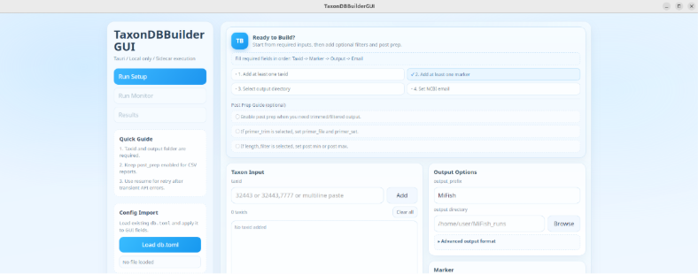
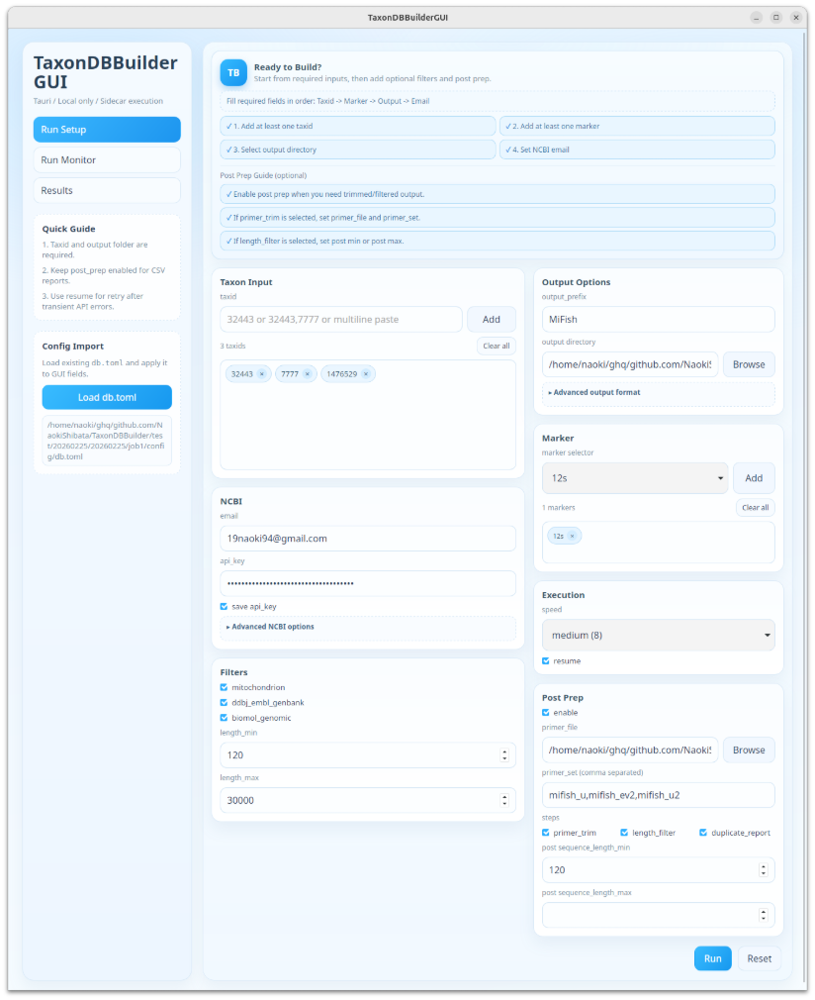
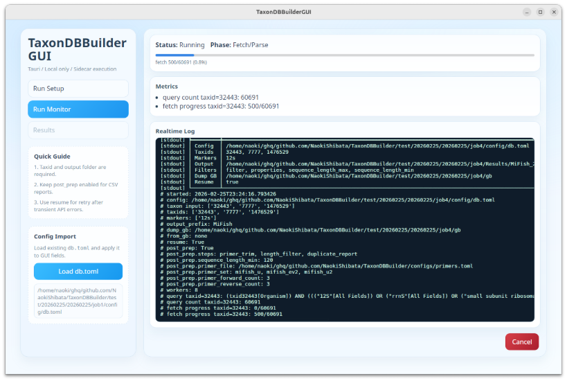
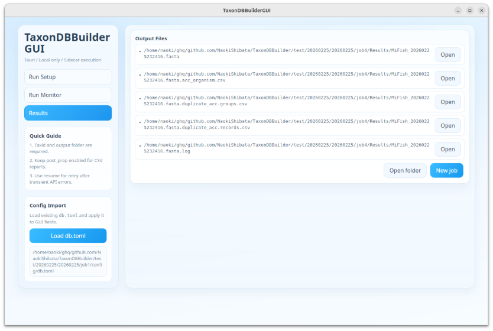

# TaxonDBBuilder GUI

[TAURI](https://v2.tauri.app)と呼ばれるRustで書かれたフレームワークを使ってGUIを生成して配列のダウンロードを実行することが可能です。



## 概要

GUIアプリをビルドして配列ダウンロードを実行可能です。基本的にサーバーは不要です。

## GUIアプリとして使う

### 前提ツールのインストール

以下のツールが必要です。

- `uv` (Python環境/パッケージ管理)
- Node.js / npm
- Rust / cargo
- Linuxの場合はTauri依存ライブラリ

#### 1) uv のインストール

```bash
mkdir -p ~/tools/uv
curl -LsSf https://astral.sh/uv/install.sh | env UV_INSTALL_DIR="$HOME/tools/uv" sh
export PATH="$HOME/tools/uv:$PATH"
uv --version
```

#### 2) Node.js / npm のインストール

`nvm` を使う例:

```bash
curl -fsSL https://raw.githubusercontent.com/nvm-sh/nvm/v0.40.3/install.sh | bash
source ~/.bashrc  # zshの場合は ~/.zshrc
nvm install --lts
node --version
npm --version
```

#### 3) Rust / cargo のインストール

```bash
curl https://sh.rustup.rs -sSf | sh -s -- -y
source "$HOME/.cargo/env"
rustc --version
cargo --version
```

#### 4) Linux の Tauri 依存ライブラリ (Ubuntu/Debian)

```bash
sudo apt-get update
sudo apt-get install -y \
  pkg-config \
  libwayland-dev \
  libxkbcommon-dev \
  libwebkit2gtk-4.1-dev \
  libgtk-3-dev \
  libayatana-appindicator3-dev \
  librsvg2-dev \
  patchelf
```

### ビルド手順

`taxonomy.db` の生成・更新手順は [taxonomy-db-build](../docs/taxonomy-db-build.md) を参照してください。
GUI は起動時に `taxonomy.db` を探索します（例: `tauri-gui/resources/taxonomy.db`）。

`tools/build_taxonomy_db.py` を使って `taxonomy.db` を生成する場合は、リポジトリルートで以下を実行します。

```bash
# names.dmp から CSV と SQLite を一括生成
python3 tools/build_taxonomy_db.py all \
  --names-dmp /path/to/taxdump/names.dmp \
  --out-csv tauri-gui/resources/taxid_scientific_name.csv \
  --out-db tauri-gui/resources/taxonomy.db
```

個別実行する場合:

```bash
# 1) names.dmp -> CSV
python3 tools/build_taxonomy_db.py extract-csv \
  --names-dmp /path/to/taxdump/names.dmp \
  --out-csv tauri-gui/resources/taxid_scientific_name.csv

# 2) CSV -> taxonomy.db
python3 tools/build_taxonomy_db.py build-sqlite \
  --in-csv tauri-gui/resources/taxid_scientific_name.csv \
  --out-db tauri-gui/resources/taxonomy.db
```

> GUI実行経路はRust統合済みのため、GUIビルド/実行だけであればPythonランタイムは不要です。

続けて `tauri-gui/` でGUIをビルドします。

```bash
# 移動
cd tauri-gui
# 依存パッケージをすべてインストール
npm install
# Build
npm run tauri:build
```

### 実行

生成物を起動します。Linuxですと`.AppImage`ファイルが対象になります。

```bash
${PWD}/src-tauri/target/release/bundle/appimage/TaxonDBBuilderGUI_0.1.0_amd64.AppImage
```

アプリが立ち上がれば完了

### GUIアプリの使い方

一番簡単なパラメーターの入力方法はコマンドライン実行で使用していた`db.toml`をロードすることです。

<details>
<summary><code>db.toml</code> の例を表示</summary>

```toml
[ncbi]
# Provide either in config or via env vars NCBI_EMAIL / NCBI_API_KEY.
email = "your-email@example.com"
api_key = "Your API KEY"

db = "nucleotide"
rettype = "gb"
retmode = "text"
per_query = 500
use_history = true
# delay_sec overrides default rate-limit delay.
# delay_sec = 0.34

# Output header format
[output]
default_header_format = "{acc_id}|{organism}|{marker}|{label}|{type}|{loc}|{strand}"

[output.header_formats]
simple = "{acc_id}|{marker}|{loc}"
verbose = "{acc_id}|{organism_raw}|{marker_raw}|{label_raw}|{type_raw}|{loc}|{strand}"
mifish_pipeline = "gb|{acc_id}|{organism}"

# Taxon options
[taxon]
# If true, do not expand descendants in taxon search.
noexp = false

[markers]
# Marker definitions are loaded from an external file.
file = "configs/markers_mitogenome.toml"

# Optional filters. If unset, no filtering is applied.
[filters]
filter = ["mitochondrion","ddbj_embl_genbank"]
properties = ["biomol_genomic"]
sequence_length_min = 120
sequence_length_max = 30000
# publication_date_from = "1990/01/01"
# publication_date_to = "2025/12/31"
# modification_date_from = "2024/01/01"
# modification_date_to = "2026/12/31"
# all_fields_include = ["12S"]
# all_fields_exclude = ["WGS"]
# raw = "complete[prop]"

# Optional post-processing for the generated FASTA.
[post_prep]
# Enable with CLI option: --post-prep
# Runtime step selection example:
# --post-prep-step primer_trim --post-prep-step duplicate_report
# Parameters are required only for enabled steps:
# - length_filter: sequence_length_min + sequence_length_max
# - primer_trim: primer_file + primer_set
# primer candidates: `python3 taxondbbuilder.py list-primer-sets -c configs/db.toml`
sequence_length_min = 120
# sequence_length_max = 300
primer_file = "<Path to TaxonDBBuilder repo>/configs/primers.toml"
primer_set = ["mifish_u","mifish_ev2","mifish_u2","mifish_l"]
```

</details>

設定情報は`~/.taxondb_gui/config.json`に自動保存されます。API keyは`save api_key`をオフにすると保存されません。



情報を入力できたら**Run**をクリックしてダウンロードを開始します。

`Run Monitor`のタブに移行します。こちらではダウンロード状況をRealtime Logウィンドウで確認することが可能です。また、止めたければCancelボタンを押せば止まります。



ダウンロードが完了したら、`Results`タブに移行します。`Run Setup`で出力フォルダに指定した場所に下記のような構造のフォルダが生成されると思います。

```bash
/home/naoki/ghq/github.com/NaokiShibata/TaxonDBBuilder/test
└── 20260225
    └── job4
        ├── config
        │   ├── db.toml
        │   ├── markers_mitogenome.toml
        │   └── primers.toml
        ├── gb
        │   ├── taxid1476529
        │   ├── taxid32443
        │   └── taxid7777
        └── Results
            ├── MiFish_20260225232416.fasta
            ├── MiFish_20260225232416.fasta.acc_organism.csv
            ├── MiFish_20260225232416.fasta.duplicate_acc.groups.csv
            ├── MiFish_20260225232416.fasta.duplicate_acc.records.csv
            └── MiFish_20260225232416.fasta.log
```

内容はおおよそコマンドライン実行と同様です。また、GUIの**OPEN**をクリックするとエディタでファイルを開くことが可能です。


